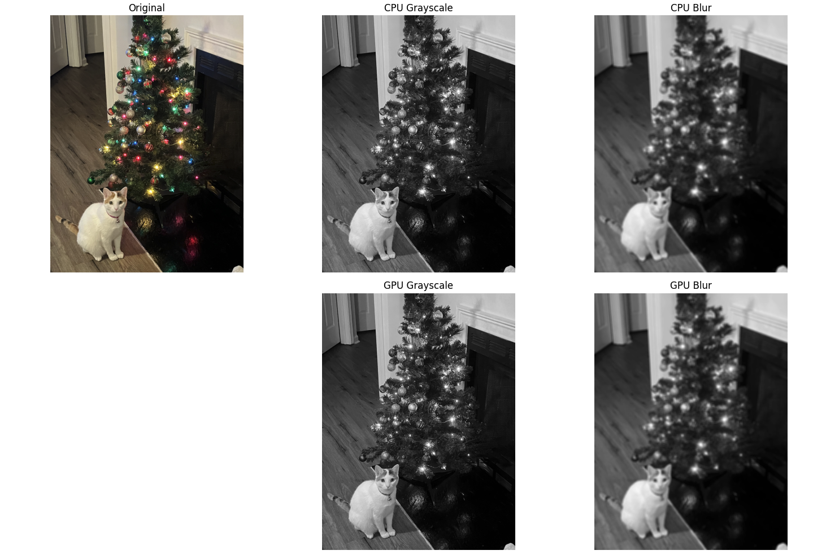

# Parallel Optimization Analysis for Image Processing

  

## Overview
This project presents a comparative analysis of image processing operations — **grayscale conversion** and **Gaussian blur** — implemented across:
- CPU processing  
- CUDA GPU implementation  
- OpenCV’s optimized functions  

The goal was to evaluate execution times, consistency, and performance scaling using Google Colab’s GPU environment.  

Results show that CUDA GPU implementation can process images **~1000× faster than CPU** for blur operations and **~10× faster than OpenCV-GPU**, while maintaining greater consistency across multiple runs.  

---

## Table of Contents
- [Introduction](#introduction)
- [Background](#background)
- [Design](#design)
- [Evaluation & Results](#evaluation--results)
- [Conclusion](#conclusion)
- [Future Work](#future-work)
- [Contribution](#contribution)
- [How to Run](#how-to-run)
- [References](#references)

---

## Introduction
Image processing optimization is increasingly critical with the rise of AI and computer vision applications.  
With GPUs now widely available in cloud and consumer devices, parallel processing can significantly outperform traditional CPU-based approaches.  

This project demonstrates the real-world benefits of GPU acceleration by comparing CPU, GPU, and OpenCV implementations.

---

## Background
- **CPU vs GPU**: CPUs process tasks sequentially, while GPUs leverage thousands of cores to perform massive parallel computations.  
- **Operations Studied**:  
  - *Grayscale conversion* — simple weighted RGB to grayscale transformation.  
  - *Gaussian blur* — convolution operation using kernels (computationally intensive).  

---

## Design
Three approaches were implemented and compared:
1. **CPU implementation** (serial pixel-by-pixel processing)  
2. **CUDA GPU implementation** (16×16 thread blocks, optimized memory access)  
3. **OpenCV implementation** (using `cv2.cvtColor` and `cv2.GaussianBlur`)  

### Methodology
- Tested with various image sizes  
- 10 trials per operation  
- Used **trimmed mean** to remove outliers and ensure consistent benchmarking  
- Focused on runtime, consistency, and scalability  

---

## Evaluation & Results
- **CPU**: Inconsistent and slow due to multitasking and resource allocation.  
- **OpenCV (CPU)**: More stable, but limited by CPU hardware.  
- **OpenCV (GPU)**: Improved performance, but less consistent than CUDA.  
- **CUDA GPU**:  
  - ~810× faster than CPU  
  - ~33× faster than OpenCV-CPU  
  - ~2.75× faster than OpenCV-GPU  
  - Highest consistency and efficiency  

**Example:** Gaussian Blur runtime:  
- CPU ≈ 12.68 seconds  
- CUDA GPU ≈ 0.00011 seconds  

---

## Conclusion
- GPUs vastly outperform CPUs for parallelizable tasks like Gaussian blur.  
- CUDA implementations achieve superior speed and consistency compared to OpenCV.  
- As GPU technology advances, the performance gap between CPU and GPU will continue to widen.  

---

## Future Work
- Explore additional image processing algorithms  
- Investigate **memory optimization** and **scalability** across larger datasets  
- Compare performance across different GPU architectures  

---

## Contribution
- Researched convolution and image processing algorithms  
- Implemented CPU, GPU (CUDA), and OpenCV solutions  
- Benchmarked performance with multiple trials  
- Documented results and analysis  

---

## How to Run
This project was implemented in **Google Colab** with GPU runtime.  

1. Upload a sample image (e.g., `sample.png`) to your Google Drive.  
2. Mount Google Drive in Colab.  
3. Run the notebook cells in this order:  
   - CPU implementation (cells 3–5)  
   - OpenCV implementation (cell 9)  
   - Switch to **T4 GPU runtime** in Colab  
   - CUDA GPU implementation (cells 6–8)  
   - Rerun OpenCV implementation (cell 9) for GPU comparison  
   - Final cell (10) outputs processed images  

---

## References
1. Introduction to OpenCV, 2024.  
2. NVIDIA Corporation. *Separable Convolution.* Technical documentation, 2007.  
3. Gloria Bueno Garcia & Oscar Deniz Suarez. *Learning Image Processing with OpenCV.* Packt Publishing, 2015.  

