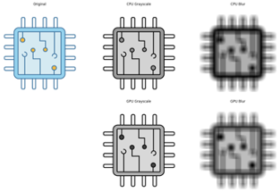

# Parallel optimization Analysis for Image Processing

This project explores the difference in computing power between a CPU (Central Processing Unit) and a GPU (Graphics Processing Unit). 
It demonstrates how parallel computing on a GPU can significantly outperform the serial computing of a CPU, using image processing tasks as a benchmark.

Grayscale conversion and Gaussian blur  (which involves convolution to smooth the image.) 
Both tasks are executed using a CPU and a GPU. 
The time taken for each computation is measured to provide a clear comparison of their performance.

CUDA Optimization: CUDA (Compute Unified Device Architecture) is used to leverage the GPU's parallel processing capabilities, 
making it possible to compute multiple pixels simultaneously.

